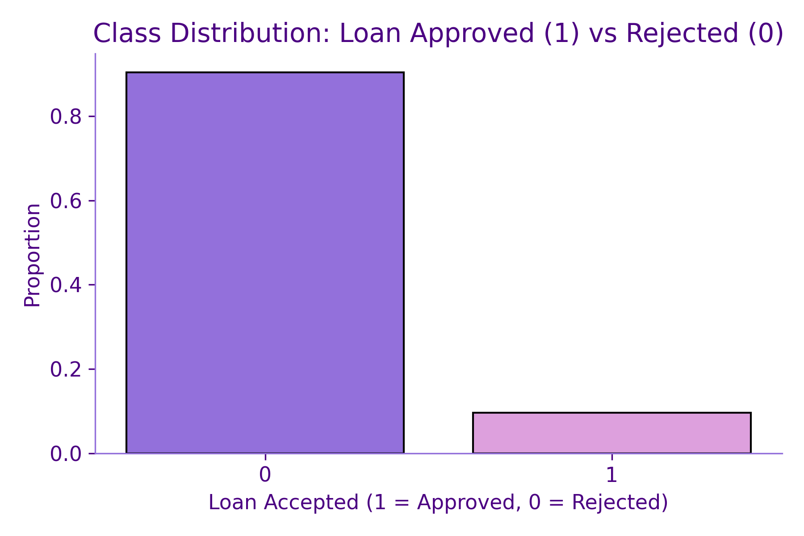
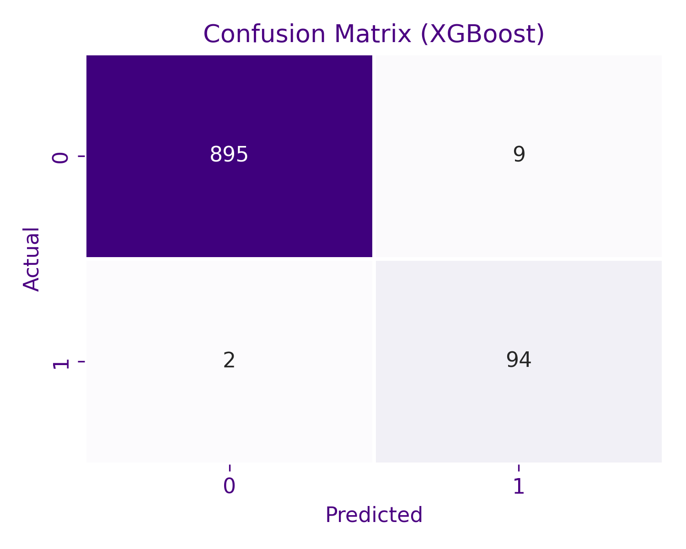
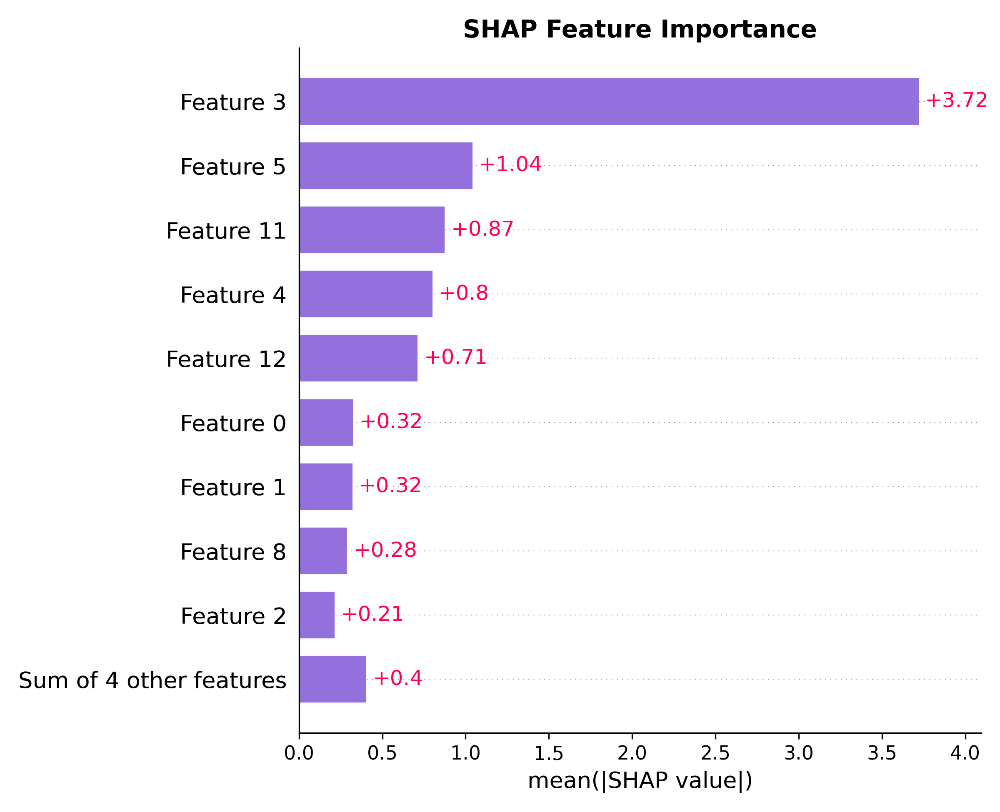
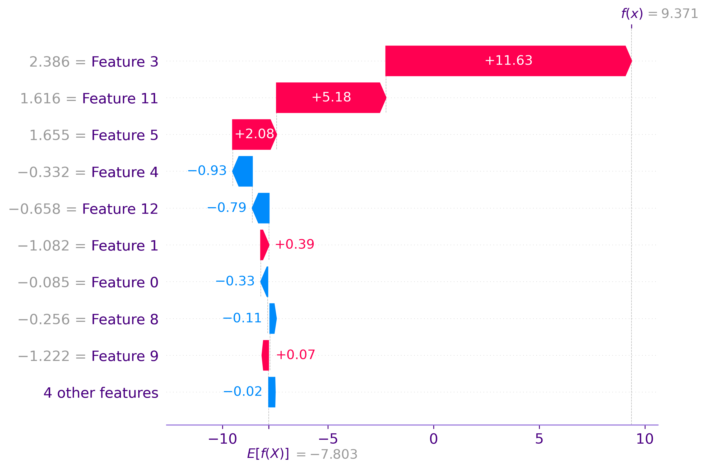

# 📘 Loan Default Prediction with SHAP Explainability

Most models can tell you **what** they predict. But few can explain **why**.  
In this project, we built a real-world **loan approval classifier** — and made it transparent using SHAP.

---

## 📂 Dataset Overview

We used the [Bank Personal Loan Dataset](https://www.kaggle.com/datasets/yasserh/loan-default-dataset) that simulates banking data across demographics, accounts, and approvals.

| Column Name        | Description                               |
|--------------------|-------------------------------------------|
| `Age`, `Income`    | Demographic info                          |
| `Mortgage`, `CCAvg`| Financial behavior                        |
| `Education`, `Family` | Profile attributes                    |
| `CD Account`, `Online`, `CreditCard` | Account types            |
| `Personal Loan`    | ✅ **Target**: 1 = Approved, 0 = Rejected |

---

## 🧠 Why This Project?

Our previous models (like clustering or regression) were excellent for understanding customer behavior.

This time, we wanted to:
- Make **binary decisions** (approve or reject loan)
- Learn how to **explain model predictions**
- Use this project as a **launchpad into trustworthy AI**

---

## 🧪 Step-by-Step Process

### 1️⃣ Data Exploration + Cleaning

We started by understanding feature distributions and checking class imbalance:

<p align="center">
  
</p>

> We had class imbalance (fewer approvals), but not extreme.  
> So we opted for **class weights** instead of oversampling.

---

### 2️⃣ Feature Engineering + Preprocessing

- No missing values  
- Encoded categorical features like `Education`, `Family`  
- Scaled all numerical features for tree models  
- Train-test split: 80/20  

---

### 3️⃣ Model Training & Evaluation

We used two models:
- ✅ **Logistic Regression** (baseline)
- ✅ **XGBoost** (advanced)

<p align="center">
  
</p>

> XGBoost outperformed Logistic Regression across the board.

### 📈 Final Performance (XGBoost)

| Metric        | Score   |
|---------------|---------|
| Accuracy      | 99%     |
| ROC AUC       | 0.999   |
| Precision (1) | 91%     |
| Recall (1)    | 98%     |

✅ No underfitting or overfitting.  
✅ Model generalized well on unseen customers.

---

## 🔍 Model Explainability (SHAP)

Understanding **why** a model made a decision is as important as the decision itself — especially in finance.

We used **SHAP (SHapley Additive exPlanations)** to break down individual predictions.

### 📊 Global Feature Importance

<p align="center">
  
</p>

> Features like **Income**, **CD Account**, and **Credit Card Usage** strongly influenced decisions.

---

### 🔍 Local Explanation for a Single Prediction

We asked the model to explain **why it approved one specific customer**.

<p align="center">
  
</p>

### 🤖 Model Reasoning (for this approval)

- 💰 **Income = 2.39** → Strongly increased approval likelihood  
- 💾 **CD Account = 1** → Indicates strong financial health  
- 💳 **CreditCard = 1** → Slight credibility boost  
- 🏠 **Mortgage = 0.01** → Very low debt = less risky  
- 👨‍👩‍👧 **Family = 4** → Suggests responsibility  

> ✅ This was **not a black-box**.  
> SHAP helped us understand the “why” behind the prediction — a critical step for trust in AI.

---

## 🧭 Summary of Steps

Here's the journey in 7 clear steps:

1. 📥 Load + explore the dataset (class imbalance, correlation)  
2. 🧼 Clean and encode the features  
3. 🔀 Train/test split (with class weights for imbalance)  
4. ⚙️ Train Logistic Regression + XGBoost  
5. 🧾 Evaluate models (confusion matrix, ROC AUC)  
6. 🔎 Explain global & local predictions with SHAP  
7. 💡 Humanize decisions for business understanding  

---

## 🧠 What I Learned

- Explainability (SHAP) is *not optional* for real-world ML  
- Class imbalance needs strategy, not just oversampling  
- XGBoost isn’t just powerful — it’s interpretable too  
- **Performance metrics** must be balanced with **trust**  

---

## 📦 Folder Structure

```
loan-default-prediction/
├── assets/                       # All saved plots (confusion matrix, SHAP, etc.)
├── notebook.ipynb                # Jupyter Notebook (step-by-step)
├── data/                         # Raw dataset (xlsx or CSV)
└── README.md                     # You’re here!
```

---

## 🚀 What’s Next?

This project now acts as the **classification bridge** between:
- 👈 Previous clustering/segmentation projects  
- 👉 Upcoming projects in **fairness**, **risk modeling**, and **trustworthy ML**

---

> Built as part of my journey to not just make AI smarter — but make it understandable.